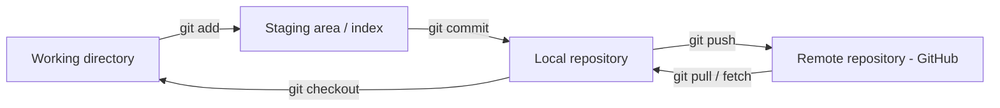

# LIS 467 — Session 2, Part 5: Version Control (Git & GitHub)

**Course:** LIS 467 — Web Development & Information Architecture
**Topic:** Why Version Control, How Git Works (Working Directory → Staging → Local Repo → Remote), Core Git Commands
**Source:** Panopto lecture transcript — "Session 2 Part 5 Version Control"

---

## 1. The Problem: Sharing Code in a Team

When working in a team you need to share code (CSS, JavaScript, any language) with teammates. The naive options all fall short:

| Method | Problem |
|--------|---------|
| **Email attachments** | ⚠️ No coordination — what if two people edit the same file at the same time? |
| **"Sneakernet"** (thumb drives, hard disks, CD-ROMs) | ⚠️ Physically transporting copies; same conflict problem |
| **Cloud storage** (Google Docs, Dropbox) | ⚠️ No **merging** for code, no **syntax highlighting**, not designed for source code |

---

## 2. Git: A Version Control System Designed for Code

🔑 **Git** is a version control system that lets you:

- ✅ Control your **source code** and its different **versions**
- ✅ **Track all changes** submitted — who changed what, and why
- ✅ **Revert** changes / go back to previous versions
- ✅ Create **branches** — work on something separately without disturbing the main code, then **merge** it back if it works
- ✅ Detect **conflicts** when merging

### Why Git specifically?

- ⭐ It's the **#1 version control system** — nearly every programmer/developer uses it
- ⭐ If you work in industry, you will work with it

### Other version control systems

GitHub (hosting), **GitLab**, **Beanstalk**, Apache **Subversion**, Microsoft **Team Foundation Server**, **Mercurial**, **CVS** (Concurrent Versions System), **RCS**, **Bitbucket**, etc. Git is covered here because it's the most popular.

---

## 3. GitHub: The Remote Repository

⭐ **github.com** is a hosting service acting as the **remote repository** for your code:

- Create an account and host your repositories
- Browse repositories published by other people
- **Clone** local copies, modify them, **commit** to your local repository, and **push** back to the remote
- One giant "repository of repositories" for all kinds of code

💡 **Distributed** design: every user maintains a **local copy of the entire repository** — a mirror of the remote server on your own computer. Multiple people work simultaneously on their own local repositories, committing locally and pushing/pulling to stay in sync.

---

## 4. The Four Areas of Git

| Area | What it is |
|------|------------|
| **Working directory (workspace)** | The local files you're editing right now — do anything you want here; initially nothing is tracked |
| **Staging area (index)** | Files "getting ready" to be committed — add files when they're ready; you can also remove files from staging |
| **Local repository** | Your local copy of the full version history — commits land here with messages |
| **Remote repository** | The shared server copy (e.g., GitHub) — push commits up, pull others' work down |

---

## 5. Core Git Commands

| Command | Purpose |
|---------|---------|
| `git init` | Initialize a new repository from scratch in the current directory |
| `git clone` | Copy an existing remote repository onto your local computer |
| `git status` | Check the state of the current project |
| `git add` | Move file changes from the working directory to the **staging area** |
| `git commit` | Record staged changes into the **local repository** — ⭐ always with a **commit message** describing what you changed, so teammates can see, and so you can later see exactly what changed in every version |
| `git push` | Send local commits to the **remote repository** so the rest of the team can access them |
| `git pull` | Fetch the most up-to-date copy from the server — 🔑 always pull before working so you build on the latest version, not a stale copy |
| `git fetch` | Get updates from the remote into the local repository |
| `git checkout` | Get files from the local repository (or staging) back into your working directory; also switches branches |
| `git branch <name>` | Create a branch — try things out without disturbing existing files; multiple branches can exist; merge back when ready |
| `git diff` | Check differences between checkpoints/versions |

💡 Connect to remotes over HTTPS or **SSH**. Install Git via the command line (most developers), or GUI clients like **GitHub Desktop** for Windows/Mac; the command-line interface works like standard Linux/UNIX commands.

---

## 6. Why It Matters: The "Jenny" Scenario

⚠️ **Without version control:** Jenny makes an error just before a big release; the bad code ships and the customer is unhappy, with no easy way back.

✅ **With version control:** Jenny pushes her changes, the error is caught in review/merge before release — and even if it ships, the team can **revert** to the previous working version.

---

## 7. Key Terms Glossary

| Term | Definition |
|------|------------|
| **Version control system (VCS)** | Software that tracks changes to files, supports reverting, branching, and merging |
| **Git** | The dominant distributed VCS, designed for source code |
| **GitHub** | Web hosting service for Git remote repositories |
| **Repository (repo)** | The stored project + its full version history |
| **Working directory** | Your local editable files (untracked until added) |
| **Staging area (index)** | Holding area for changes about to be committed |
| **Commit** | A recorded snapshot of staged changes, with a message |
| **Push / Pull** | Send commits to / retrieve updates from the remote repository |
| **Clone** | Copy an entire remote repository to your computer |
| **Branch** | A separate line of development that doesn't disturb the main code |
| **Merge** | Combining a branch's changes back in (Git flags conflicts) |
| **Sneakernet** | Physically carrying files on drives/disks — the pre-VCS "solution" |

---

## 8. Quick Review Questions

1. Why are email, sneakernet, and Dropbox/Google Docs inadequate for sharing code?
2. What four capabilities does Git give you that those methods lack?
3. What is the relationship between Git and GitHub?
4. Name the four areas of Git and the commands that move changes between them.
5. Why should every commit include a message?
6. Why should you `git pull` before starting work?
7. What is a branch for, and what happens when you merge?
8. Name three version control systems other than Git.
9. In the "Jenny" scenario, how does version control prevent (or recover from) a bad release?

---

*This concludes Session 2: why web design, requirements gathering, responsive/mobile-first design, project management, and version control.*
